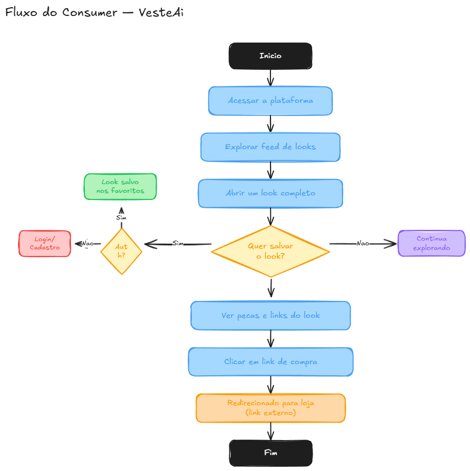
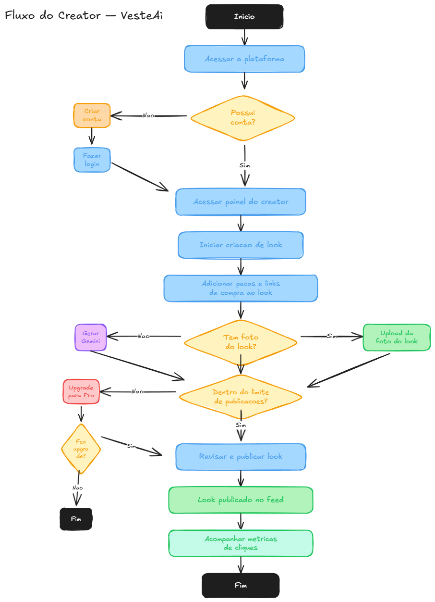
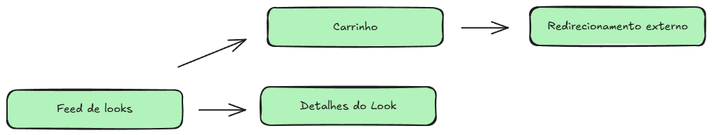
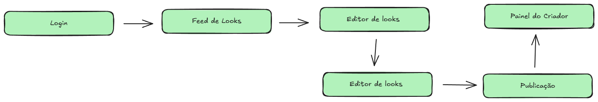
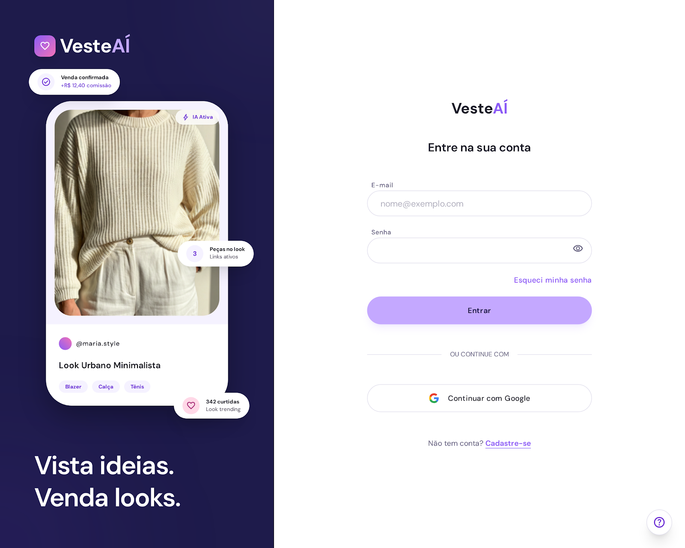
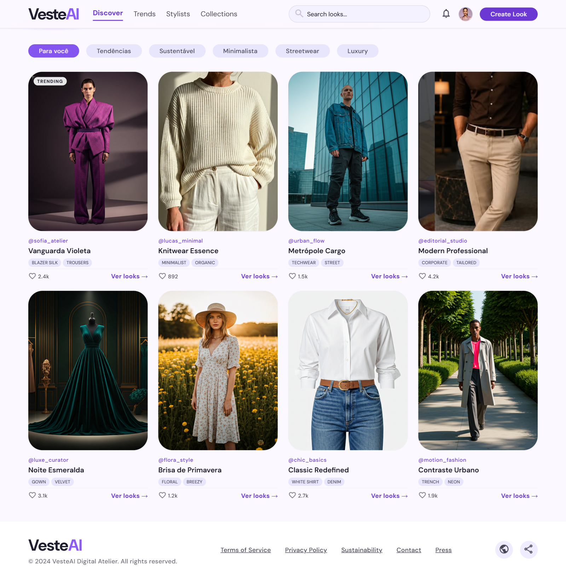
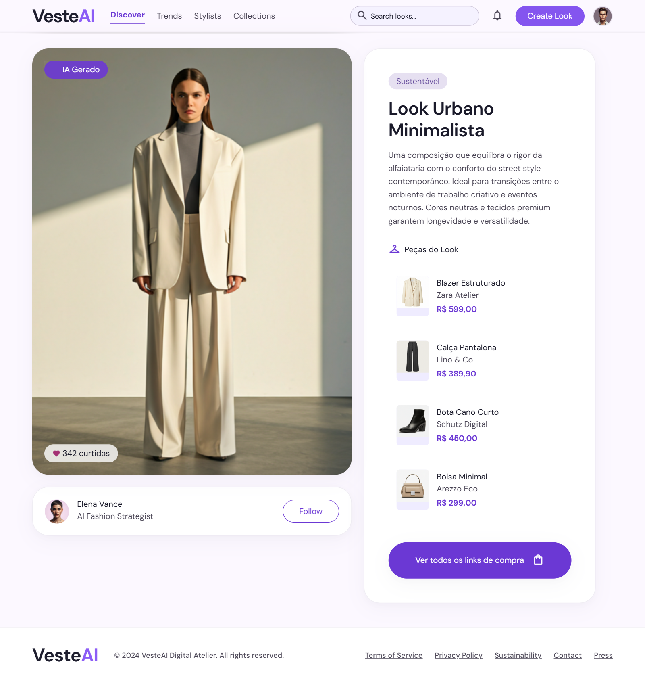
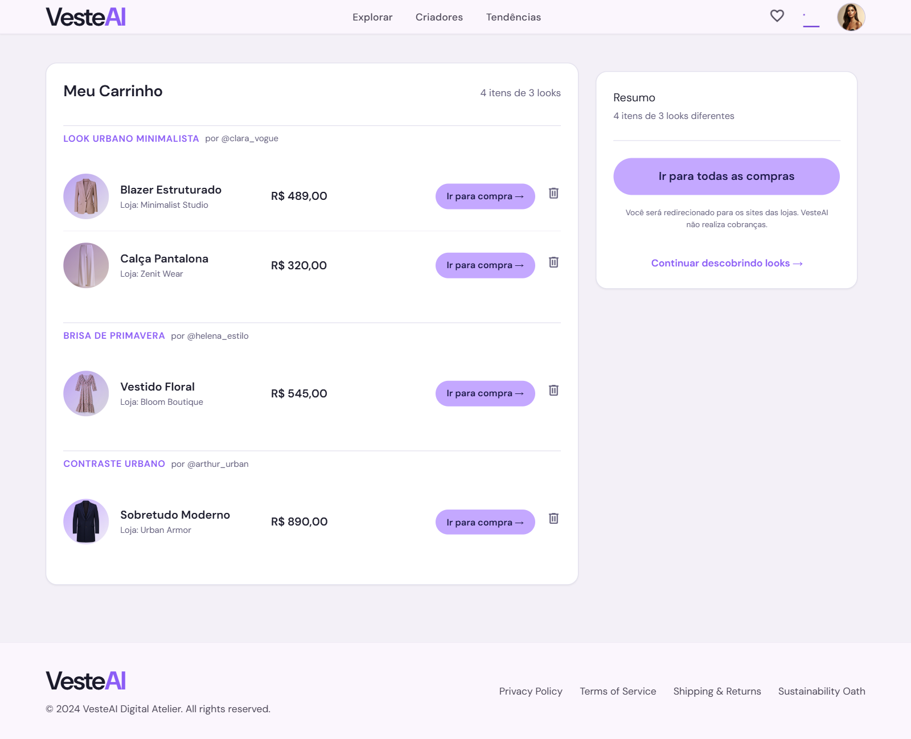
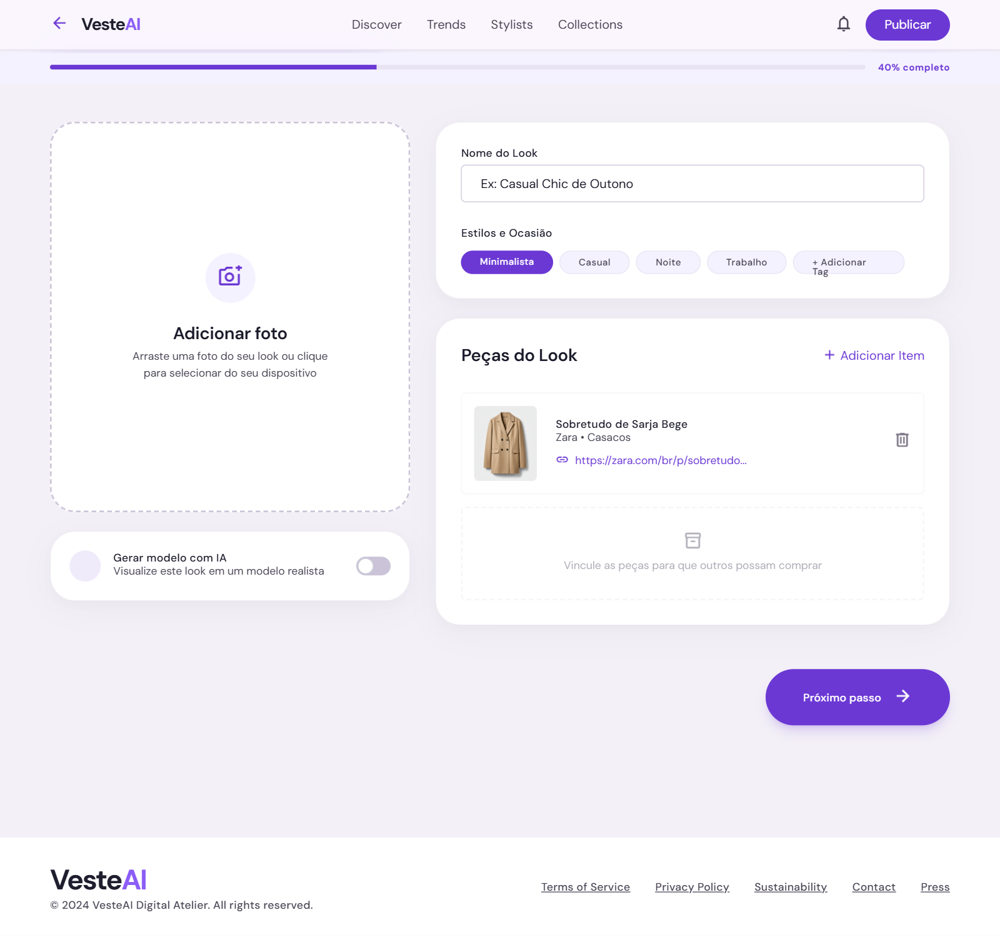

# RFC — VesteAí
**Request for Comments — Projeto de Portfólio**
Católica SC — Engenharia de Software — 8º Semestre

---

# Identificação

- **Título do Projeto:**  
  VesteAí

- **Linha de Projeto (Direction):**  
  Web

- **Autor:**  
  Kalebe Fukuda de Oliveira

- **Data da Proposta:**  
  08/04/2026

- **Versão:**  
  1.0

---

# 1. Visão do Produto e Impacto (O Problema)

## 1.1 Contexto e Problema

A moda é um dos maiores mercados de consumo online do Brasil. Plataformas
como Instagram, Pinterest e TikTok são amplamente utilizadas para inspiração
de moda, gerando alto engajamento com looks e combinações de peças. No
entanto, existe uma lacuna estrutural entre o momento de inspiração e o
momento de compra — e uma oportunidade de monetização ignorada para quem
cria conteúdo de moda de forma amadora.

**Quem sofre com esse problema**

Dois perfis distintos enfrentam barreiras hoje:

- **Consumidores** que encontram looks interessantes nas redes sociais mas
  não conseguem comprar as peças com facilidade — seja o look completo ou
  cada item individualmente.
- **Pessoas com interesse em moda** que gostariam de montar e divulgar looks
  usando peças de diferentes lojas e ganhar uma renda extra através de links
  de afiliado, mas não têm uma plataforma própria para isso.

**Em que contexto ocorre**

Ao encontrar um look interessante em qualquer rede social, o fluxo típico
do consumidor é:

1. Ver o look e se interessar
2. Tentar identificar cada peça manualmente (marca, modelo, loja)
3. Buscar cada peça em sites diferentes
4. Frequentemente não encontrar exatamente o que viu
5. Desistir da compra

Um exemplo real desse comportamento pode ser observado abaixo — um post de
moda no Instagram onde seguidores pedem nos comentários o preço e o link
das peças, sem receber nenhuma resposta centralizada:

Do lado de quem quer criar conteúdo de moda, o problema é diferente:
não existe uma plataforma dedicada para montar looks com peças de múltiplas
lojas, associar links de afiliado a cada peça e publicar tudo em um único
lugar para gerar renda com as vendas que esse conteúdo influencia.

**Como é resolvido atualmente**

Não existe uma solução centralizada para nenhum dos dois lados. O consumidor
depende de buscas manuais em múltiplos e-commerces. Quem quer monetizar
curadoria de moda recorre a ferramentas genéricas como o Linktree ou
depende de comentários e stories nas redes sociais — sem controle sobre
métricas, sem organização por look e sem uma experiência dedicada para
o consumidor final.

Plataformas como Pinterest chegam a redirecionar para produtos similares
via Amazon, mas a solução é limitada: funciona apenas com o catálogo
americano, não suporta lojas brasileiras como Shopee, Shein, Renner ou C&A,
e não oferece nenhuma forma de monetização para quem criou o conteúdo:

**Limitações das soluções atuais**

As redes sociais entregam inspiração mas não oferecem links de compra
organizados por look. Os e-commerces oferecem compra mas não curadoria.
Ferramentas de link em bio são genéricas e não foram feitas para composição
de looks com múltiplas peças. O resultado é uma fricção alta na jornada
do consumidor e uma oportunidade de renda desperdiçada para quem tem
gosto por moda mas não tem onde canalizar isso.

## 1.2 Origem da Demanda e Evidências

### Pesquisa com Usuários

Foram realizadas conversas informais com 5 pessoas dos dois perfis de
usuário da plataforma. Não houve formulário estruturado — as conversas
seguiram um roteiro livre com foco em identificar dores no processo de
compra de moda online e no uso de links de afiliado.

**Perfis entrevistados:** consumidores de moda online e pessoas que já
utilizam links de afiliado em plataformas como Shopee.

**Principais dores identificadas:**

| Perfil | Dor relatada |
|---|---|
| Consumidor | Dificuldade em encontrar onde comprar peças de looks vistos nas redes sociais |
| Consumidor | Necessidade de pesquisar em vários sites para montar um look completo |
| Criador | Falta de uma plataforma dedicada para montar e publicar looks com links de afiliado |
| Criador | Dificuldade em organizar links de produtos de lojas diferentes em um só lugar |

**Padrão observado:** todos os entrevistados demonstraram interesse em uma
plataforma unificada para descoberta e compra de looks.

### Evidência de Interesse

O comportamento de busca por links nos comentários de posts de moda é um
padrão recorrente e documentado nas redes sociais. A imagem abaixo ilustra
um post no Instagram onde seguidores pedem o preço e o link das peças
diretamente nos comentários, sem receber nenhuma resposta centralizada —
evidência direta da dor que o VesteAí se propõe a resolver:

### Contexto de Mercado

Os dados do mercado brasileiro reforçam que o problema ocorre em um
segmento de alto volume e crescimento acelerado:

- A moda é o **segmento líder do e-commerce nacional em volume**, com
  crescimento de 35% nas vendas em 2025, faturando R$ 2,9 bilhões segundo
  a pesquisa NuvemCommerce (2026).
- **66% dos brasileiros preferem comprar roupas, calçados e acessórios
  online**, segundo pesquisa "Consumo de moda no Brasil" do Opinion Box.
- O mercado brasileiro de **social commerce** — compras originadas
  diretamente das redes sociais — projeta crescimento de 16,1% ao ano,
  atingindo US$ 4,16 bilhões em 2025, segundo dados da Wake.
- O **Instagram é utilizado organicamente por 97% das lojas de moda**,
  o maior índice entre todos os setores do e-commerce nacional
  (NuvemCommerce, 2026).

Esses dados indicam que o comportamento de descoberta de moda pelas redes
sociais já é consolidado no Brasil — e que a lacuna entre inspiração e
compra ocorre justamente no segmento de maior crescimento do e-commerce
nacional.

## 1.3 Análise de Soluções Existentes (Benchmark)

### Pinterest
**Link:** https://pinterest.com  
**Público-alvo:** Usuários em busca de inspiração visual em geral  
**Funcionalidades principais:**
- Feed de imagens organizadas por interesse
- Redirecionamento automático para produtos similares via Amazon
- Salvar pins em coleções pessoais

**Limitações:**
- Redirecionamento funciona apenas com catálogo da Amazon (EUA)
- Não suporta lojas brasileiras como Shopee, Shein, Renner ou C&A
- O link de produto é gerado automaticamente por reconhecimento de imagem,
  não por curadoria intencional de um criador
- Não existe monetização para quem publicou o conteúdo original
- Não há conceito de "look completo" — cada peça é tratada isoladamente

---

### LTK (LikeToKnowIt)
**Link:** https://shopltk.com  
**Público-alvo:** Influenciadores de moda e consumidores globais  
**Funcionalidades principais:**
- Criadores publicam looks com links de afiliado de múltiplas lojas
- Feed navegável com looks completos e shoppable
- App dedicado com mais de 8 milhões de usuários mensais
- Parceria com mais de 7.000 varejistas globais

**Limitações:**
- Plataforma americana com foco no mercado norte-americano e europeu
- Não tem integração nativa com as principais lojas brasileiras
  (Shopee, Mercado Livre, Shein BR, Renner, C&A)
- Exige aprovação para criadores — não é aberto para qualquer pessoa
- Requer audiência prévia nas redes sociais para ser aceito como criador
- Interface e suporte em inglês, sem localização para o Brasil

---

### OQVestir
**Link:** https://oqvestir.com.br  
**Público-alvo:** Consumidores brasileiros de moda premium  
**Funcionalidades principais:**
- E-commerce multimarcas com mais de 300 marcas nacionais e internacionais
- Curadoria editorial com sugestões de looks prontos
- Seções "Looks da Semana" e "Novidades"

**Limitações:**
- É um e-commerce: só vende peças do próprio catálogo
- Não permite links de lojas externas (Shopee, Shein, etc.)
- Não existe figura de criador — a curadoria é feita internamente
  pela equipe editorial
- Não há monetização para usuários externos
- Foco em moda premium, excluindo o público que compra em marketplaces

---

### Instagram e TikTok
**Links:** https://instagram.com / https://tiktok.com  
**Público-alvo:** Criadores de conteúdo e consumidores em geral  
**Funcionalidades principais:**
- Publicação de fotos e vídeos de looks com grande alcance orgânico
- Link na bio para redirecionar seguidores
- Instagram Shopping para marcas parceiras

**Limitações:**
- Não existe uma forma nativa de organizar múltiplos links de afiliado
  por look — criadores dependem de ferramentas externas como Linktree
- O consumidor precisa sair da plataforma e buscar cada peça manualmente
- Não há rastreamento de cliques por peça ou por look
- Instagram Shopping só está disponível para marcas, não para criadores
  independentes com links de afiliado de múltiplas lojas
- O conteúdo se perde no feed com o tempo — não há organização por look

---

### Comparação

| Solução | Pontos Fortes | Limitações |
|---|---|---|
| Pinterest | Inspiração visual consolidada, grande base de usuários | Só integra Amazon (EUA), sem monetização para criadores, sem suporte a lojas BR |
| LTK | Modelo mais próximo do VesteAí, links de afiliado por look, app dedicado | Foco no mercado americano, sem lojas BR, exige aprovação e audiência prévia |
| OQVestir | Curadoria editorial brasileira, e-commerce consolidado | Catálogo fechado, sem criadores externos, sem links de lojas parceiras |
| Instagram/TikTok | Alcance massivo, criadores ativos em moda | Sem links organizados por look, sem rastreamento por peça, sem monetização direta |

---

### Diferencial do Projeto

**Por que criar algo novo?**

Nenhuma das soluções existentes resolve os dois lados do problema
simultaneamente para o mercado brasileiro:

- O **LTK** é a referência global mais próxima do VesteAí, mas é
  construído para o mercado americano e europeu. Não tem integração
  com as lojas onde o brasileiro de fato compra — Shopee, Mercado Livre,
  Shein, Renner e C&A — e exige que o criador já tenha uma audiência
  consolidada para ser aceito na plataforma.

- O **Pinterest** entrega inspiração mas não resolve a compra, e o
  **Instagram/TikTok** entregam alcance mas não entregam organização
  nem monetização estruturada.

- O **OQVestir** é brasileiro mas é um e-commerce fechado — a curadoria
  é editorial, não existe criador independente, e o consumidor só pode
  comprar peças do catálogo da própria plataforma.

**Qual lacuna o VesteAí preenche?**

O modelo do VesteAí é inspirado no LTK, plataforma americana que valida
globalmente que esse modelo funciona. O Brasil é o nono maior mercado de
e-commerce do mundo, com moda como categoria líder em volume — e não existe
nenhuma plataforma equivalente ao LTK construída para esse mercado.

O VesteAí preenche essa lacuna com dois diferenciais centrais:

1. **Focado no mercado brasileiro:** construído para o consumidor e o
   criador brasileiro, com compatibilidade com Shopee, Mercado Livre,
   Shein, Renner e C&A — as plataformas de e-commerce mais consumidas
   pelo público brasileiro
2. **Acesso aberto para criadores:** qualquer pessoa com gosto por moda
   pode criar um perfil e começar a monetizar, sem necessidade de
   audiência prévia ou aprovação editorial

## 1.4 Público-Alvo

O VesteAí atende dois perfis de usuário distintos:

### Consumidores

**Perfil:** Pessoas entre 18 e 35 anos com interesse em moda, que utilizam
redes sociais como Instagram, Pinterest e TikTok para buscar inspiração de
looks no dia a dia.

**Contexto de uso:** Navegam pelo feed em busca de looks completos para
ocasiões específicas — trabalho, lazer, eventos — e querem poder comprar
as peças sem precisar pesquisar em múltiplos sites.

**Nível técnico esperado:** Básico. Familiarizados com redes sociais e
compras online em marketplaces como Shopee e Mercado Livre.

---

### Criadores

**Perfil:** Pessoas com interesse em moda e senso estético desenvolvido,
que já montariam looks por prazer mas não têm uma plataforma dedicada para
publicar e monetizar essa curadoria. Não necessariamente possuem audiência
prévia em outras redes sociais.

**Contexto de uso:** Montam looks combinando peças de diferentes lojas,
associam links de afiliado a cada peça e publicam no feed da plataforma
para gerar renda extra com as compras que seus looks influenciam. Incluem
pessoas que já utilizam programas de afiliados em plataformas como Shopee.

**Nível técnico esperado:** Básico a intermediário. Familiarizados com
redes sociais e com o conceito de links de afiliado.

## 1.5 Objetivos do Projeto

### Objetivo Geral

Centralizar em uma única plataforma a descoberta e a compra de looks de
moda para o mercado brasileiro, eliminando a fricção entre inspiração e
compra para o consumidor e criando uma oportunidade de renda para pessoas
que têm gosto por moda mas não têm onde monetizar essa curadoria.

---

### Objetivos Específicos

1. Desenvolver um feed navegável de looks completos com links de compra
   centralizados, permitindo que o consumidor acesse todas as peças de
   um look em um único lugar
2. Construir um editor de looks que permita ao criador montar composições
   com peças de múltiplas lojas e associar links de afiliado a cada peça
3. Integrar o Google Gemini como ferramenta de apoio ao criador na
   composição visual dos looks
4. Registrar e exibir métricas de cliques por look, dando ao criador
   visibilidade sobre o desempenho do seu conteúdo
5. Disponibilizar a plataforma em produção como um produto funcional,
   acessível publicamente e validado com usuários reais

## 1.6 Métricas de Sucesso (KPIs)

- Pelo menos 5 looks publicados no feed por criadores reais até o Demo Day
- Pelo menos 1 clique em link de compra registrado por look publicado
- Suporte a 200 usuários simultâneos sem degradação de performance
- Cobertura mínima de 70% de testes unitários no back-end
- Integração com Google Gemini funcional com geração de imagem em menos
  de 30 segundos
- Aplicação acessível publicamente via URL estável em ambiente de produção

# 2. Engenharia de Requisitos
## 2.1 Personas

### Persona 1 — Creator

**Nome:** Isabela Rocha, 24 anos
**Contexto:** Estudante de moda em São Paulo, produz conteúdo no Instagram e TikTok há 2 anos. Tem cerca de 8 mil seguidores e recebe frequentemente perguntas como *"onde você comprou essa blusa?"*. Hoje responde nos comentários ou stories, mas os links se perdem rapidamente.

**Objetivos:**
- Centralizar os links das peças que usa em um único lugar
- Monetizar seu conteúdo através de comissões de afiliados
- Criar looks completos combinando peças de diferentes lojas (Shein, Renner, Shopee)
- Ganhar visibilidade além dos seus seguidores atuais

**Principais dificuldades:**
- Perde tempo respondendo manualmente onde cada peça foi comprada
- Não tem uma forma organizada de apresentar um look completo com múltiplos links
- Não consegue rastrear quantas pessoas clicaram nos seus links
- Ferramentas como Linktree são genéricas demais — não foram feitas para looks

---
### Persona 2 — Consumer

**Nome:** Mariana Costa, 27 anos
**Contexto:** Analista de marketing em Florianópolis, acompanha perfis de moda no Instagram e TikTok diariamente. Se inspira em looks que vê nas redes, mas frequentemente desiste da compra porque não consegue identificar onde cada peça foi comprada ou encontra apenas lojas internacionais sem entrega viável no Brasil.

**Objetivos:**
- Descobrir looks completos já montados, prontos para comprar
- Encontrar peças em lojas brasileiras com frete acessível
- Salvar looks que gostou para consultar depois
- Comprar o visual inteiro sem precisar gastar horas pesquisando cada peça

**Principais dificuldades:**
- Looks inspiracionais nas redes sociais raramente têm todos os links das peças
- Quando os links existem, muitas vezes apontam para lojas fora do Brasil
- Não há um lugar centralizado só para moda brasileira com curadoria humana
- Processo de "montar o look" é fragmentado e trabalhoso

## 2.2 Casos de Uso Principais

Os principais fluxos do sistema estão organizados em dois perfis de acesso: **Visitante** (não autenticado) e **Usuário Autenticado**. Qualquer usuário autenticado pode tanto consumir looks quanto publicar como creator — não há separação de contas.

**Visitante:**
- Explorar feed de looks
- Visualizar look completo
- Clicar em link de compra

**Usuário Autenticado:**
- Criar conta e configurar perfil
- Salvar looks favoritos
- Criar e publicar looks com peças e links de afiliado
- Editar e remover looks próprios
- Visualizar métricas de cliques nos seus looks

## 2.3 Requisitos Funcionais (RF)

### Acesso e Autenticação

RF01 — O sistema deve permitir que o visitante crie uma conta.
RF02 — O sistema deve permitir que o usuário faça login com e-mail e senha.
RF03 — O sistema deve permitir que o usuário recupere sua senha via e-mail.
RF04 — O sistema deve permitir que o usuário configure seu perfil (nome, foto e bio).

### Descoberta de Looks

RF05 — O sistema deve permitir que o visitante explore o feed de looks publicados.
RF06 — O sistema deve permitir que o visitante visualize um look completo com todas as peças e links.
RF07 — O sistema deve permitir que o visitante clique em um link de compra e seja redirecionado para a loja externa.

### Interação do Usuário Autenticado

RF08 — O sistema deve permitir que o usuário salve looks favoritos.
RF09 — O sistema deve permitir que o usuário acesse sua lista de looks salvos.

### Gestão de Looks (Creator)

RF10 — O sistema deve permitir que o usuário crie um look com título, descrição e foto de referência.
RF11 — O sistema deve permitir que o usuário adicione peças ao look com nome, link de afiliado e imagem.
RF12 — O sistema deve permitir que o usuário publique o look tornando-o visível no feed.
RF13 — O sistema deve permitir que o usuário edite um look já publicado.
RF14 — O sistema deve permitir que o usuário remova um look publicado.
RF15 — O sistema deve validar se o link de compra cadastrado está acessível e não redireciona para domínios sinalizados como maliciosos.

### Métricas

RF16 — O sistema deve registrar cada clique em links de compra e exibir o total por look ao usuário criador.

### Auxiliar de Criação

RF17 — O sistema deve permitir que o usuário faça upload de uma foto de referência ao criar um look.

## 2.4 Requisitos Não Funcionais (RNF)

### Desempenho

RNF01 — O feed de looks deve carregar em menos de 2 segundos em condições normais de rede.
RNF02 — O redirecionamento para links de compra deve ocorrer em menos de 500ms.
RNF03 — A API deve responder às requisições em menos de 300ms para operações de leitura.

### Segurança

RNF04 — O sistema deve utilizar autenticação segura com tokens JWT.
RNF05 — As senhas dos usuários devem ser armazenadas com hash utilizando bcrypt.
RNF06 — A comunicação entre cliente e servidor deve ser realizada exclusivamente via HTTPS.
RNF07 — O sistema deve proteger endpoints sensíveis contra acesso não autenticado.

### Disponibilidade

RNF08 — O sistema deve ter disponibilidade mínima de 99% ao mês.

### Escalabilidade

RNF09 — A arquitetura deve suportar o crescimento do volume de looks e usuários sem necessidade de refatoração estrutural.
RNF10 — O banco de dados deve ser estruturado para suportar paginação eficiente no feed de looks.

### Usabilidade

RNF11 — A interface deve ser responsiva e funcionar adequadamente em dispositivos móveis e desktop.
RNF12 — O fluxo de criação de um look deve ser concluído em no máximo 5 etapas.

## 2.5 Regras de Negócio

### Acesso e Autenticação

RN01 — Apenas usuários autenticados podem criar, editar e remover looks.
RN02 — Apenas usuários autenticados podem salvar looks favoritos.
RN03 — O feed de looks e os links de compra são acessíveis sem autenticação.

### Looks e Peças

RN04 — Um look só pode ser publicado se tiver ao menos uma peça com link de compra cadastrado.
RN05 — Cada peça de um look deve conter obrigatoriamente nome e link de compra.
RN06 — O creator é o único responsável pela validade dos links de compra — o VesteAí não valida nem garante os links externos.
RN07 — Um creator só pode editar ou remover looks criados por ele mesmo.
RN08 — Todo look deve conter ao menos uma imagem para ser publicado, seja por upload direto ou gerada por IA.

### Métricas

RN09 — O registro de clique é contabilizado apenas quando o usuário é redirecionado para a loja externa.
RN10 — As métricas de cliques são visíveis apenas para o creator do look.

## 2.6 Fora do Escopo

- O sistema não processará pagamentos diretamente — as transações ocorrem nas lojas externas
- O sistema não realizará integração direta com programas de afiliados — a gestão dos links é responsabilidade do creator
- O sistema não oferecerá funcionalidade de chat ou mensagens entre usuários
- O sistema não permitirá a venda de produtos diretamente na plataforma
- O sistema não realizará curadoria ou moderação automática de looks publicados

# 3. Fluxos e Comportamento do Sistema

Esta seção demonstra como o sistema funciona na prática, descrevendo os
caminhos percorridos pelos dois perfis de usuário da plataforma — consumer
e creator — e os desvios mais relevantes que o sistema deve tratar.

---

## 3.1 Fluxo Principal do Usuário

O VesteAí possui dois fluxos principais distintos, um para cada perfil de
usuário. Ambos são independentes e refletem jornadas fundamentalmente
diferentes: o consumer descobre e compra, o creator monta e publica.

---

### Fluxo do Consumer

O consumer acessa a plataforma sem necessidade de autenticação. A jornada
começa pela exploração do feed de looks publicados, onde pode abrir qualquer
look completo e visualizar todas as peças com seus respectivos links de
compra. O clique em um link redireciona o consumer diretamente para a loja
externa, que é o ponto de conversão central da plataforma.

Caso o consumer queira salvar um look nos favoritos, o sistema verifica se
está autenticado. Se não estiver, é direcionado para login ou cadastro antes
de concluir a ação. Se já estiver autenticado, o look é salvo imediatamente.
Essa é a única ação do consumer que exige autenticação — explorar o feed e
clicar em links de compra são acessíveis a qualquer visitante.

---

### Fluxo do Creator

O creator precisa estar autenticado para publicar looks. Ao acessar a
plataforma, o sistema verifica se possui conta — caso contrário, passa pelo
cadastro e login antes de acessar o painel. A partir do painel, inicia a
criação do look adicionando título, descrição e as peças com seus respectivos
links de compra.

A etapa seguinte exige que o creator forneça uma imagem para o look, que é
obrigatória para publicação. Se já tiver uma foto do look, faz o upload
diretamente. Caso contrário, utiliza o assistente Gemini para gerar uma
imagem de referência. Sem imagem — seja por upload ou gerada pelo Gemini —
o look não pode ser publicado.

Antes de publicar, o sistema verifica se o creator está dentro do limite de
publicações do seu plano. Se tiver atingido o limite, é apresentada a opção
de upgrade para o plano Pro. Caso opte por não fazer o upgrade, o fluxo é
encerrado sem publicação. Caso faça o upgrade ou já esteja dentro do limite,
o look é revisado e publicado, tornando-se visível no feed da plataforma.
Após a publicação, o creator pode acompanhar as métricas de cliques no seu
painel.

---

## 3.2 Fluxos Alternativos

Esta seção descreve os principais desvios do caminho feliz — situações de
erro, cancelamento ou exceção que o sistema deve tratar de forma explícita.

---

### FA01 — Visitante tenta salvar look sem autenticação

**Contexto:** O visitante clica em "salvar look" sem estar autenticado.

**Comportamento esperado:** O sistema interrompe a ação e exibe um prompt
de login ou cadastro. Após autenticação bem-sucedida, o sistema retoma a
ação e salva o look nos favoritos automaticamente, sem exigir que o usuário
repita o gesto.

---

### FA02 — Creator tenta publicar look sem imagem

**Contexto:** O creator conclui o preenchimento das peças e tenta publicar
sem ter fornecido uma imagem — nem por upload nem via Gemini.

**Comportamento esperado:** O sistema bloqueia a publicação e exibe uma
mensagem informando que a imagem é obrigatória. O creator permanece na tela
de criação e pode escolher entre fazer upload ou gerar via Gemini antes de
tentar publicar novamente.

---

### FA03 — Creator tenta publicar look sem nenhuma peça com link

**Contexto:** O creator tenta publicar um look sem ter adicionado nenhuma
peça com link de compra cadastrado.

**Comportamento esperado:** O sistema bloqueia a publicação e exibe uma
mensagem informando que ao menos uma peça com link de compra é obrigatória
(RN04). O creator permanece na tela de criação para completar o look antes
de tentar novamente.

---

### FA04 — Link de compra inválido ou malicioso

**Contexto:** O creator cadastra um link de compra que está inacessível ou
aponta para um domínio sinalizado como malicioso.

**Comportamento esperado:** O sistema executa a validação do link (RF15) e,
ao detectar o problema, exibe uma mensagem de erro indicando qual link falhou
na validação. O creator pode corrigir ou substituir o link antes de prosseguir.
Links que passam na validação técnica mas são inválidos comercialmente
permanecem sob responsabilidade do creator (RN06).

---

### FA05 — Erro na geração de imagem pelo Gemini

**Contexto:** O creator opta por gerar a imagem via Gemini, mas a requisição
falha por erro da API ou timeout.

**Comportamento esperado:** O sistema exibe uma mensagem de erro informando
que a geração não foi concluída e oferece duas opções: tentar novamente ou
fazer upload manual de uma imagem. O look em criação não é perdido — as
peças e links já cadastrados são preservados.

---

### FA06 — Creator atinge limite de publicações e não faz upgrade

**Contexto:** O creator tenta publicar um look mas já atingiu o limite de
publicações do plano gratuito e, ao ser apresentado ao upgrade Pro, decide
não prosseguir.

**Comportamento esperado:** O sistema encerra o fluxo de publicação sem
descartar o look. O rascunho é preservado no painel do creator, permitindo
que retome e publique quando decidir fazer o upgrade ou quando um slot
de publicação estiver disponível.

---

# 4. Mockups e Experiência do Usuário (UX)

> **Observação:** Os mockups apresentados nesta seção são a base para construção da aplicação. Eles
> representam a estrutura, os fluxos e a intenção de design da plataforma,
> mas não constituem o design final da interface. Elementos visuais como
> tipografia, espaçamento, paleta de cores e componentes estão sujeitos
> a revisão durante o desenvolvimento.

Esta seção apresenta a visualização inicial do produto antes da
implementação. Os mockups foram utilizados para validar o fluxo de
navegação, a organização da interface, as interações dos dois perfis de
usuário e a clareza da experiência como um todo.

---

## 4.1 Fluxo de Navegação

O VesteAí possui dois fluxos de navegação distintos, refletindo as
jornadas documentadas na Seção 3. Ambos partem do feed de looks como
tela central e divergem conforme o perfil e a intenção do usuário.

**Jornada do Consumer:**

**Jornada do Creator:**

Os diagramas completos, incluindo desvios e fluxos alternativos, estão
na [Seção 3](#3-fluxos-e-comportamento-do-sistema).

---

## 4.2 Wireframes e Mockups das Telas

### Tela 1 — Login e Cadastro

A tela de autenticação adota um layout dividido em dois painéis. O painel
esquerdo é visual e exibe o card de look característico da
plataforma com os floating badges de engajamento, reforçando a proposta
de valor do produto no momento de entrada do usuário. O painel direito
contém o formulário de autenticação com campos de e-mail e senha, opção
de login via Google e link para cadastro.

A mesma tela serve tanto para login quanto para o redirecionamento
descrito no FA01 — quando um visitante tenta salvar um look sem
autenticação, é encaminhado para esta tela e, após autenticar, retorna
automaticamente à ação interrompida.

**Requisitos cobertos:** RF01, RF02, RF03, RF04

---

### Tela 2 — Feed de Looks

O feed é a tela central da plataforma e o ponto de entrada para o
consumidor. A navegação superior apresenta os filtros de categoria em
pills horizontais, permitindo que o usuário refine o conteúdo
sem sair da tela.

O conteúdo é organizado em um grid uniforme de quatro colunas, com
cards de proporção padronizada seguindo a convenção de marketplaces de
moda. Cada card exibe a foto do look, o handle do creator, o título,
as tags de estilo, a contagem de curtidas e um link direto para o look
completo. O visitante não precisa estar autenticado para navegar no feed
— a exploração é aberta a qualquer usuário (RN03).

**Requisitos cobertos:** RF05, RF06

---

### Tela 3 — Detalhes do Look

A tela de detalhes é o ponto de conversão da jornada do consumer. O
layout é dividido em duas colunas: à esquerda, a imagem do look em
proporção destacada com badges de "IA Gerado" e contagem de curtidas;
à direita, o painel com título, tags, descrição e a lista de peças.

Cada peça exibe nome, loja, preço indicativo e um botão de acesso ao
link de compra externo. O botão principal "Ver todos os links de compra"
ao final da lista direciona o usuário para o carrinho, onde os links
ficam agregados antes do redirecionamento. Um aviso explícito informa
que o VesteAí não realiza cobranças — as transações ocorrem nas lojas
externas (RN06, seção 2.6).

**Requisitos cobertos:** RF06, RF07, RF08

---

### Tela 4 — Carrinho

O carrinho do VesteAí não é um checkout — não processa pagamentos nem
armazena dados financeiros. Sua função é agregar os itens salvos de
múltiplos looks e centralizar os links de compra externos em um único
lugar, eliminando a necessidade de o usuário abrir cada look
separadamente para acessar cada link.

Os itens são agrupados pelo look de origem, com o handle do creator
identificado em cada grupo. Cada item exibe nome, loja, preço indicativo
e um botão individual "Ir para compra →" que abre o link externo em
nova aba. O botão "Ir para todas as compras" no painel de resumo dispara
todos os links simultaneamente. Um aviso abaixo do botão reforça que o
VesteAí não realiza cobranças e que o usuário será redirecionado para
os sites das lojas.

**Requisitos cobertos:** RF07, RF08, RF09

---

### Tela 5 — Editor de Looks

O editor é a tela central do fluxo do creator. O layout de duas colunas
separa responsabilidades visuais das informacionais: à esquerda, a área
de upload da imagem do look com o toggle de geração via IA; à direita,
os campos de nome, tags de estilo e a lista de peças com links.

Uma barra de progresso no topo da tela indica o avanço no processo de
criação. A lista de peças permite adicionar, visualizar e remover itens
individualmente, com o link de compra visível para cada peça cadastrada.
O botão "Publicar" na barra de navegação permanece desabilitado até que
os requisitos mínimos de publicação sejam atendidos — ao menos uma peça
com link e uma imagem (RN04, RN08).

**Requisitos cobertos:** RF10, RF11, RF12, RF13, RF14, RF15, RF17

---

### Tela 6 — Painel do Creator

O painel centraliza as métricas de desempenho dos looks publicados pelo
creator. A tela é dividida em sidebar à esquerda — com seletor de
período e atalhos de navegação — e área principal à direita com os
indicadores e a tabela de performance.

Os dois cards de métrica exibem cliques totais e visualizações de looks,
ambas as métricas coletadas pela própria plataforma. A tabela "Performance
by Look" lista cada look publicado com data, volume de cliques representado
por uma barra proporcional e status de publicação. Não há dados financeiros
ou de comissão no painel — a monetização ocorre fora da plataforma, nos
programas de afiliados de cada loja, e é de responsabilidade do creator
(seção 2.6).

**Requisitos cobertos:** RF16

---

## 4.3 Fluxo de Interação do Usuário

### Fluxo do Consumer — Descoberta e Compra

1. Usuário acessa a plataforma e visualiza o **Feed de Looks** sem
   necessidade de autenticação
2. Aplica filtro de categoria (ex: "Minimalista") para refinar o conteúdo
3. Clica em um card de look para abrir os **Detalhes do Look**
4. Visualiza as peças, loja e preço indicativo de cada item
5. Clica em "Ver todos os links de compra" e é direcionado ao **Carrinho**
6. No carrinho, revisa os itens agrupados por look de origem
7. Clica em "Ir para todas as compras" e é redirecionado para as lojas
   externas em novas abas — a transação ocorre fora da plataforma

> **Desvio (FA01):** se o usuário tentar salvar um look sem estar
> autenticado, o sistema redireciona para a tela de **Login** e,
> após autenticação, retorna automaticamente ao look.

---

### Fluxo do Creator — Criação e Publicação

1. Creator acessa a tela de **Login** e autentica com e-mail/senha
   ou via Google
2. É direcionado ao **Feed de Looks** como tela inicial da sessão
3. Clica em "Create Look" na barra de navegação para abrir o **Editor**
4. Faz upload da foto do look ou aciona o toggle "Gerar modelo com IA"
5. Preenche o nome do look e seleciona as tags de estilo
6. Adiciona peças com nome, loja e link de compra externo
7. Clica em "Publicar" — o look passa a ser visível no feed publicamente
8. Acessa o **Painel do Creator** para acompanhar cliques e visualizações

> **Desvio (FA02/FA03):** se tentar publicar sem imagem ou sem peças
> com link, o sistema bloqueia e exibe mensagem orientando a completar
> os campos obrigatórios antes de prosseguir.

---

## 4.4 Feedback Inicial de Usuários

Os mockups foram apresentados informalmente aos mesmos 5 participantes
das conversas descritas na seção 1.2. As reações foram coletadas sem
formulário estruturado, com foco em identificar pontos de confusão ou
expectativas não atendidas na interface.

| Tela | Observação coletada |
|------|---------------------|
| Feed de Looks | Filtros de categoria foram considerados intuitivos; expectativa de busca por texto também foi mencionada |
| Detalhes do Look | A separação entre "ver o look" e "comprar as peças" ficou clara para todos os participantes |
| Carrinho | O aviso "VesteAí não realiza cobranças" foi considerado necessário e aumentou a confiança no fluxo |
| Editor de Looks | O toggle de geração por IA gerou curiosidade positiva; participantes demonstraram interesse em visualizar o resultado antes de publicar |
| Painel do Creator | A ausência de dados financeiros foi compreendida após explicação do modelo de negócio |